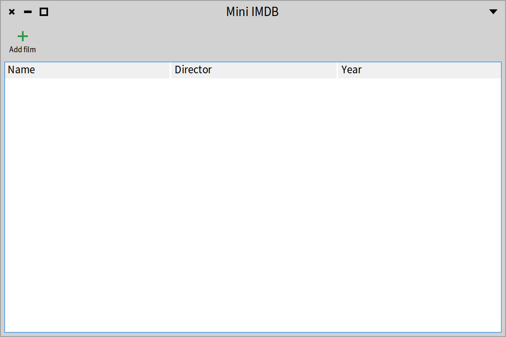
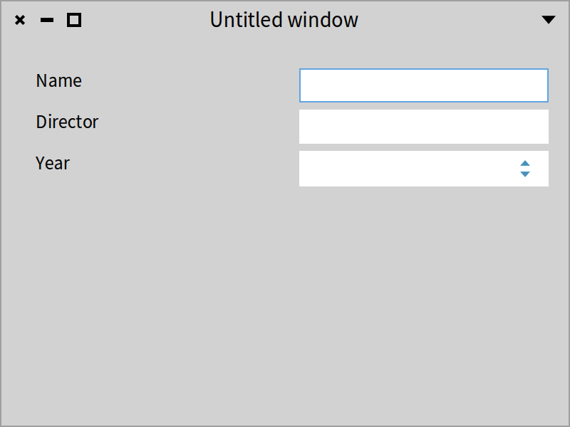
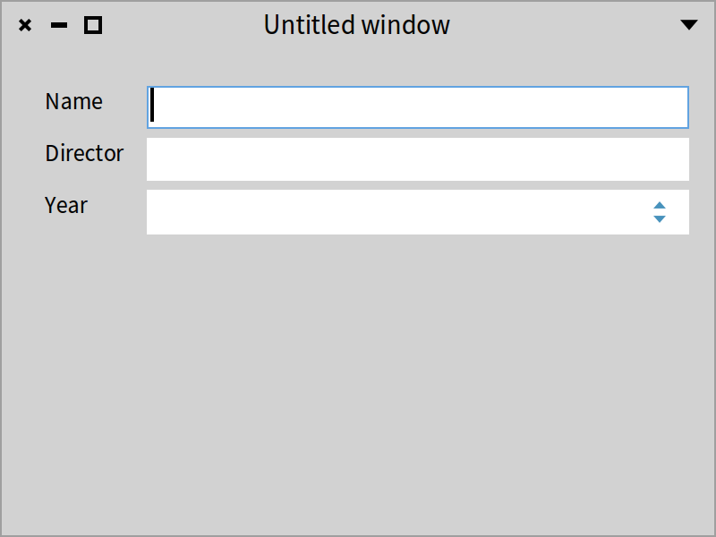
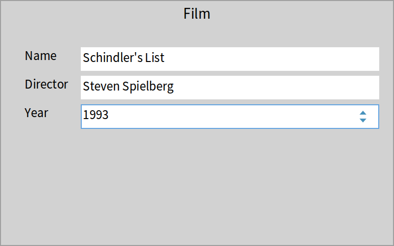
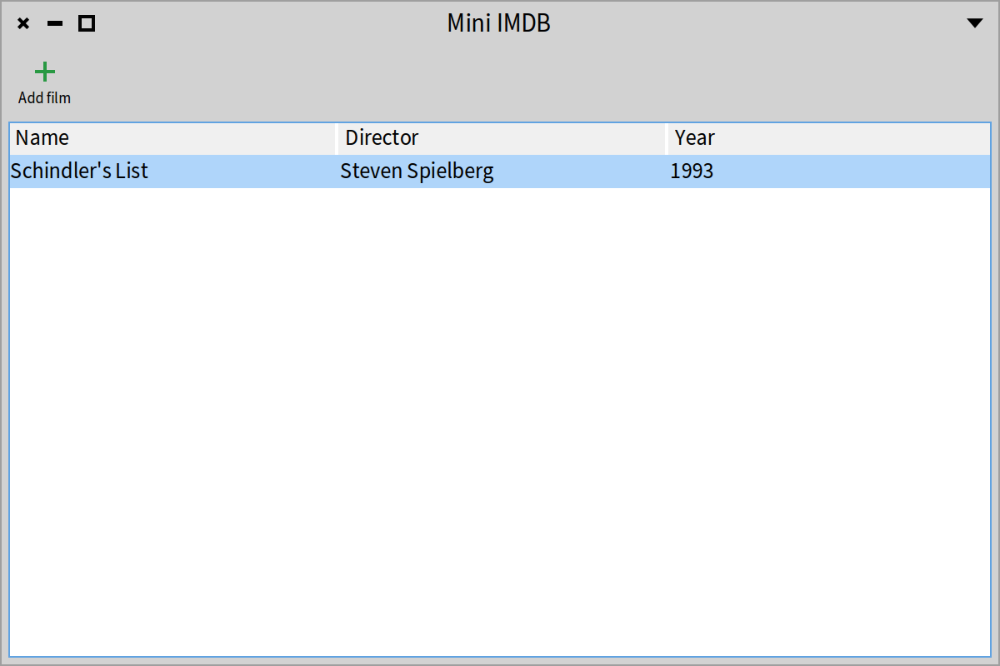
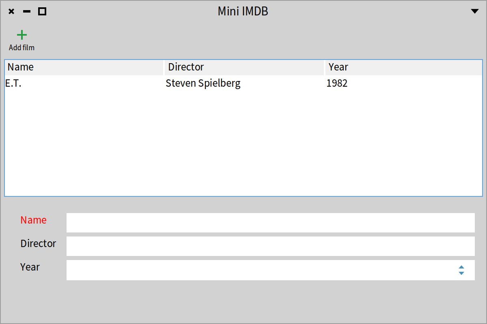

## Most of Spec in one example
@chacasestudyone

In this chapter, we will guide you through the building of a simple but non-trivial application to manage films as shown in Figure *@FullApp@*.
We will show many aspects of Spec that we will revisit in depth in the rest of this book: the application, presenters, the separation between domain and presenter, layout, transmissions to connect widgets,  and styles.


### Application

Spec 2.0 introduces the concept of an application. An application is a small object responsible for keeping the state of your application. It manages, for example, the multiple windows that compose your application, and its backend (Morphic or GTK), and can hold properties shared by the presenters.

We start with the definition of the example application class:

```
SpApplication << #ImdbApp
	package: 'CodeOfSpec20Book'
```

### A basic film model

Since we will manage films we define an `ImdbFilm` class as follows. It has a name, a year, and a director. We generate the companion accessors.

```
Object << #ImdbFilm
	slots: {#name . #year . #director};
	package: 'CodeOfSpec20Book'
```


We need a way to store and query films. We could use Voyage ([https://github.com/pharo-nosql/voyage](https://github.com/pharo-nosql/voyage)) since it works without an external Mongo DB. But we want to keep it extremely simple. So let's define a singleton.

We define a _class_ instance variable called `films`.

```
Object class << ImdbFilm class
	slots: { #films }
```


We define a method that lazy initializes the `films` variable to an ordered collection.

```
ImdbFilm class >> films

	^ films ifNil: [ films := OrderedCollection new ]
```

And to finish we define a way to add a film to the list.

```
ImdbFilm class >> addFilm: aFilm

	films add: aFilm
```

Now we are ready to define a first presenter that manages a list of films.

### List of films

We define a presenter to manage a list of films by introducing a new class named `ImdbFilmListPresenter` which inherits from `SpPresenter`. We add an instance variable named `filmList` that will hold an elementary list presenter.

```
SpPresenter << #ImdbFilmListPresenter
	slots: { #filmList };
	package: 'CodeOfSpec20Book'
```


We define how the information should be presented by defining a method named `defaultLayout`. We specify a simple vertical box layout with the `filmList` as the only element.

#### defaultLayout

```
ImdbFilmListPresenter >> defaultLayout

	^ SpBoxLayout newTopToBottom
			add: filmList;
			yourself
```

When you do not define any other methods to represent layout, `defaultLayout` is the method that is invoked by Spec logic.

A presenter can have subpresenters. `ImdbFilmListPresenter` contains a table presenter and you will see later that:
1. a presenter can have multiple layouts
2. layouts can be defined dynamically

In Spec, layouts are dynamic by default and are expressed at the instance level. To allow backward compatibility, it is still possible to define a `defaultLayout` _class-side_ method that returns a layout instead of using a `defaultLayout` instance-side method, but it is not the recommended way.

#### initializePresenters

So far, we have not initialized `filmList`.

The place to initialize the subpresenters is the method `initializePresenters` as shown below. There we define that `filmList` is a table with three columns. The message `newTable` instantiates a `SpTablePresenter`.

```
ImdbFilmListPresenter >> initializePresenters

	filmList := self newTable
		addColumn: (SpStringTableColumn title: 'Name'
			evaluated: #name);
		addColumn: (SpStringTableColumn title: 'Director'
			evaluated: #director);
		addColumn: (SpStringTableColumn title: 'Year'
			evaluated: #year);
		yourself
```

The following expression creates an instance of the film list presenter and opens it. You get the window shown in Figure *@LayoutInitilalizePresenters@*.

```
ImdbFilmListPresenter new open
```


### Filling up the film list

We define the method `updatePresenter` which is automatically invoked after `initializePresenters`. It just queries the domain (`ImdbFilm`) to get the list of the recorded films and populates the internal table. Right now we do not have any film in the singleton so the list of films is empty.

```
ImdbFilmListPresenter >> updatePresenter

	filmList items: ImdbFilm films
```

If you want, just add a film and reopen the presenter. You should see the film on the list.

```
ImdbFilm addFilm: (ImdbFilm new
	name: 'E.T.';
	director: 'Steven Spielberg';
	year: '1982';
	yourself)
```

### Opening presenters via the application

While directly creating a presenter is possible during development, a more canonical way to create a presenter is to ask the application using the message `newPresenter:` as follows.

```
| app |
app := ImdbApp new.
(app newPresenter: ImdbFilmListPresenter) open
```

The application is responsible for managing windows and other information, therefore it is important to use it to create presenters that compose the application.

### Improving the window

A presenter can be embedded in another presenter as we will show later. It can also be placed within a window and this is what the message `open` does. Spec offers another hook, the method `initializeWindow:`, to specialize the information presented when a presenter is displayed within a window.



The method `initializeWindow:` allows you to define a title, a default size (message `initialExtent:`), and a toolbar.

```
ImdbFilmListPresenter >> initializeWindow: aWindowPresenter

	| addButton toolbar |
	addButton := self newToolbarButton
			label: 'Add film' ;
			icon: (self iconNamed: #smallAdd);
			action: [ self addFilm ];
			yourself.
	toolbar := self newToolbar
		add: addButton;
		yourself.
	aWindowPresenter
		title: 'Mini IMDB';
		initialExtent: 600@400;
		toolbar: toolbar
```

You should obtain the window with a toolbar as shown in Figure *@figFilmListPresenter2@*. To make sure that the `Add film` button does not raise an error, we trigger an `addFilm` method that is defined with no behavior. In fact, we will define a different presenter to be able to define a film.

```
ImdbFilmListPresenter >> addFilm

	"empty for now"
```

As we will see in Chapter *@cha_commander@*, toolbars can be automatically created out of commands. We could have added the toolbar in that way to the `filmList` (e.g. using an instance variable) as part of the `ImdbFilmListPresenter` because the toolbar is also a presenter (similar to the table presenter or other predefined presenters). But doing it that way is less modular. Note also that the toolbar we created could be factored in a separate class to increase reuse too.


### An application manages icons

What we can see from the definition of the method `initializeWindow:` is that an application manages icons with the message `iconNamed:`. Indeed, a presenter defines the `iconNamed:` message as a delegation to its application.
In addition, your application can define its own icon set using the message `iconManager:`.

### FilmPresenter


We are ready to define a simple presenter to edit a film. We will use it to add a new film or simply display it.
We create a new subclass of `SpPresenter` named `ImdbFilmPresenter`. This class has three instance variables: `nameText`, `directorText`, and `yearNumber`.

```
SpPresenter << #ImdbFilmPresenter
	slots: { #nameText . #directorText . #yearNumber };
	package: 'CodeOfSpec20Book'
```


As we did previously, we define a default layout. This time we use a grid layout. With a grid layout, you can choose the position in the grid where your presenters will appear.

```
ImdbFilmPresenter >> defaultLayout

	^ SpGridLayout new
			add: 'Name' at: 1@1; add: nameText at: 2@1;
			add: 'Director' at: 1@2; add: directorText at: 2@2;
			add: 'Year' at: 1@3; add: yearNumber at: 2@3;
			yourself
```


Note that it is not required to create the accessors for the presenter elements as we were forced to do in Spec 1.0. Here we only create getters because we will need them when creating the corresponding `ImbdFilm` instance.

```
ImdbFilmPresenter >> year

	^ yearNumber text

ImdbFilmPresenter >> director

	^ directorText text

ImdbFilmPresenter >> name

	^ nameText text
```

For convenience, a `SpGridLayout` also comes with a builder that lets you add elements to the layout in the order they will appear. The previous layout definition can be rewritten as:

```
ImdbFilmPresenter >> defaultLayout

	^ SpGridLayout build: [ :builder |
			builder
				add: 'Name'; add: nameText; nextRow;
				add: 'Director'; add: directorText; nextRow;
				add: 'Year'; add: yearNumber ]
```

Pay attention: do not add a `yourself` message here because you would return the class and not the layout instance.



And as before, we define the method `initializePresenters` to initialize the variables to the corresponding elementary presenters. Here `nameText` and `directorText` are initialized to a text input, and `yearNumber` is a number input.

```
ImdbFilmPresenter >> initializePresenters

	nameText := self newTextInput.
	directorText := self newTextInput.
	yearNumber := self newNumberInput
		rangeMinimum: 1900 maximum: Year current year;
		yourself
```


Now we can try our little application with the following script and obtain a window similar to the one shown in Figure *@figFilmPresenter1@*:

```
| app |
app := ImdbApp new.
(app newPresenter: ImdbFilmPresenter) open
```


### Better looking FilmPresenter

We improve the look of the film presenter by specifying column behavior and setting window properties. As you can see, the form to present Film data has very large labels. Indeed, they take half of the form width. We can solve that by using non-homogenous columns and asking the second column to take the biggest possible width with `column:expand:`. See Figure *@FilmListPresenter2@*.

```
ImdbFilmPresenter >> defaultLayout

	^ SpGridLayout build: [ :builder |
			builder
				beColumnNotHomogeneous;
				column: 2 expand: true;
				add: 'Name'; add: nameText; nextRow;
				add: 'Director'; add: directorText; nextRow;
				add: 'Year'; add: yearNumber ]
```



Now we set the window properties by adding the following new `initializeWindow:` method. See Figure *@FilmListPresenter3@*.

```
ImdbFilmPresenter >> initializeWindow: aWindowPresenter

	aWindowPresenter
		title: 'Film';
		initialExtent: 400@250
```


### Opening FilmPresenter in a modal dialog

Instead of opening the film presenter in a separate window, we like to open it in a modal dialog window. The modal dialog blocks the user interface until the user confirms or cancels the dialog. A modal dialog has no window decorations and it cannot be moved.

While a window can be opened by sending `open` to an instance of a presenter class, a dialog can be opened by sending `openModal`.

```
| app |
app := ImdbApp new.
(app newPresenter: ImdbFilmPresenter) openModal
```



Figure *@dialog@* shows the result. Note that there are no UI components to close the dialog. Press the "Esc" key on the keyboard to close it.

### Customizing the modal dialog

Spec lets us adapt the dialog window, for example, to add interaction buttons. We specialize the method `initializeDialogWindow:` to add two buttons that control the behavior of the application, as shown in Figure *@Customizeddialog@*. We also center the dialog on screen by sending `centered` to the dialog presenter.

```
ImdbFilmPresenter >> initializeDialogWindow: aDialogPresenter

	aDialogPresenter centered.
	aDialogPresenter
		addButton: 'Cancel' do: [ :button | button close ];
		addButton: 'Save Film' do: [ :button | button beOk; close ].
```


### Invoking a presenter

We are ready to use the film presenter from within the film list presenter. We define the method `addFilm` in the class `ImdbFilmListPresenter`. When the user clicks on the button, we create a new film presenter that we associate with the current application.

We open the film presenter as a modal dialog using the message `openModal`. When the user presses the "Save Film" button, a new film is added to our little database and we update the list.

```
ImdbFilmListPresenter >> addFilm

	| dialog windowPresenter film |
	dialog := ImdbFilmPresenter newApplication: self application.
	windowPresenter := dialog openModal.
	windowPresenter isOk ifFalse: [ ^ self ].

	film := ImdbFilm new
		name: dialog name;
		director: dialog director;
		year: dialog yearNumber.
	ImdbFilm addFilm: film.
	self updatePresenter
```

Now we can open the `FilmListPresenter` and click on the `Add film` button. When the film data has been entered and the `Save Film` button has been clicked, you will see that the FilmListPresenter is updated with the added film, as shown in Figure *@refreshed@*

```
app := ImdbApp new.
(app newPresenter: ImdbFilmListPresenter) open
```




### Embedding a FilmPresenter into the FilmListPresenter

We have two main visual elements: a list of films and the film details. We can imagine that we would like to see the film details in the same container as the list, especially because a film description is larger than the list columns.

To achieve that, we add a new instance variable named `detail` to the class `ImdbFilmListPresenter`.

```
SpPresenter << #ImdbFilmListPresenter
	slots: { #filmList . #detail };
	package: 'CodeOfSpec20Book'
```

We redefine the default layout. We will show later that we can have different layouts.

```
ImdbFilmListPresenter >> defaultLayout

	^ SpBoxLayout newTopToBottom
		add: filmList;
		add: detail;
		yourself
```


Since we are going to use this presenter in different places, we have to add a method to control whether it is editable or not:

```
ImdbFilmPresenter >> editable: aBoolean

	nameText editable: aBoolean.
	directorText editable: aBoolean.
	yearNumber editable: aBoolean
```

Now we improve the `initializePresenters` of `ImdbFilmListPresenter`.
- First we instantiate `ImdbFilmPresenter`.
- Second, we configure it as read-only by sending the `editable: false` message.
- Third, when an element of the list is selected, we should display the information in the detail presenter. While we can express this in the `initializePresenters` method, we prefer specifying it in the `connectPresenters` method. See Section *@section_define_component_communication@*.


```
ImdbFilmListPresenter >> initializePresenters

	filmList := self newTable
		addColumn: (SpStringTableColumn title: 'Name'
			evaluated: #name);
		addColumn: (SpStringTableColumn title: 'Director'
			evaluated: #director);
		addColumn: (SpStringTableColumn title: 'Year'
			evaluated: #year);
		yourself.
	detail := self instantiate: ImdbFilmPresenter.
	detail editable: false
```

### Define component communication
@section_define_component_communication

We add a helper method named `setModel:` in class `ImdbFilmPresenter` to be able to pass a film and populate the presenter accordingly.

```
ImdbFilmPresenter >> setModel: aFilm

	aFilm
		ifNil: [
			nameText text: ''.
			directorText text: ''.
			yearNumber number: '' ]
		ifNotNil: [
			nameText text: aFilm name.
			directorText text: aFilm director.
			yearNumber number: aFilm year ]
```

It is important to check for a `nil` value, otherwise sending `name`, `director`, or `year` would fail. If the given `aFilm` argument is `nil`, we clear the three subpresenters.

Note that the method `setModel:` is needed only if you do not subclass from `SpPresenterWithModel`. If you subclass from `SpPresenter`, it is the only way to have the model initialized before the setup of the presenter, and avoid errors when opening the presenter.

Defining interactions between presenters is done in the `connectPresenters` method. We implement it to define that, when an element of the list is selected, we display the information in the detail presenter. It is worth taking some time to look at the `whenSelectionChangedDo:` method.

The `whenSelectionChangedDo:` method expects a block with at most one argument. The argument does not hold the selected item directly, but a more complex object that represents the selection. Indeed a selection is different in a single selection list and a multiple selection list. Therefore Spec defines the concept of selection mode under the form of subclasses of `SpAbstractSelectionMode`.

```
ImdbFilmListPresenter >> connectPresenters

filmList whenSelectionChangedDo: [ :selectedItemMode |
	detail setModel: selectedItemMode selectedItem ]
```

With `connectPresenters` in place, selecting an item in the list results in showing the details of the selected item, as shown in Figure *@embedded@*.


### Testing your application UI

A strong property of Spec is that we can write tests to describe the interaction and the logic of a UI. Tests are so powerful to help us create nice designs and make sure that we can spot errors, that we will show that writing tests for a UI is not complex.

We define a subclass of `TestCase`.

```
TestCase << #ImdbFilmListPresenterTest
	package: 'CodeOfSpec20Book'
```


```
ImdbFilmListPresenterTest >> testWhenSelectingOneFilmThenDetailIsUpdated

	| presenter detail |
	"Arrange"
	presenter := ImdbFilmListPresenter new.
	presenter open.
	detail := presenter detail.
	self assert: detail name isEmpty.

	"Act"
	presenter clickFilmAtIndex: 1.

	"Assert"
	self deny: detail name isEmpty.
	presenter delete
```


As you see, we will have to define two methods on `ImdbFilmListPresenter` to support proper testing: a getter for `detail` and an interaction method `clickFilmAtIndex:`.
We categorize them in the `testing - support` protocol to indicate that they are only intended for testing purposes.

```
ImdbFilmListPresenter >> detail

	^ detail

ImdbFilmListPresenter >> clickFilmAtIndex: anIndex

	filmList clickAtIndex: anIndex
```

This test is a bit poor because we do not explicitly test the value of the film’s name in the `detail` presenter. We did this to keep the test setup simple, partly because `ImdbFilm` stores the current films globally. Singletons are ugly and they also make testing more complex.

We define three helper methods on `ImdbFilm` to reset the stored films and add the E.T. film.

```
ImdbFilm class >> reset

	films := OrderedCollection new
```


```
ImdbFilm class >> addET

	films add: self ET
```


```
ImdbFilm class >> ET

	^ self new
		name: 'E.T.';
		director: 'Steven Spielberg';
		year: '1982';
		yourself
```


Now we can define the `setUp` method.

```
ImdbFilmListPresenterTest >> setUp

	super setUp.
	ImdbFilm reset.
	ImdbFilm addET
```

Now we update the test to keep the opened presenter in an instance variable. This allows us to define a `tearDown` method that always closes the presenter, no matter if the test succeeds or fails.

```
ImdbFilmListPresenterTest >> testWhenSelectingOneFilmThenDetailIsUpdated

	| detail |
	"Arrange"
	presenter := ImdbFilmListPresenter new.
	presenter open.
	detail := presenter detail.
	self assert: detail name isEmpty.

	"Act"
	presenter clickFilmAtIndex: 1.

	"Assert"
	self deny: detail name isEmpty
```


```
ImdbFilmListPresenterTest >> tearDown

	presenter ifNotNil: [ presenter delete ].
	super tearDown
```

### Adding more tests

Tests are addictive because we can change programs and check that they still work and limit our stress. So we will write another one.

Let us add the following getter method to support our tests.

```
ImdbFilmListPresenter >> filmList

	^ filmList
```

Let us test that a list has one film and that if we select a non-existent index, the name is cleared.

```
ImdbFilmListPresenterTest >> testNoSelectionClearsDetails

	| name |
	"Arrange"
	presenter := ImdbFilmListPresenter new.
	presenter open.

	"Act"
	presenter clickFilmAtIndex: 1.

	"Assert"
	name := presenter detail name.
	self deny: name isEmpty.
	self assert: presenter filmList listSize equals: 1.

	presenter clickFilmAtIndex: 2.
	self assert: presenter detail name equals: ''
```


Multiple selection is not supported. Therefore we test that `filmList` is configured for single selection. There is no `isSingleSelection` method, so instead of asserting single selection, we deny multiple selection.

```
ImdbFilmListPresenterTest >> testListIsSingleSelection

	presenter := ImdbFilmListPresenter new.
	presenter open.
	self deny: presenter filmList isMultipleSelection
```


What you see is that it is relatively simple to test that the interaction you specified actually works as expected.


### Changing layout

With Spec, a presenter can have multiple layouts, even layouts that are created on the fly as we will see with dynamic layouts. We can decide which layout to use when opening a presenter. Let us illustrate that. Imagine that we prefer to have the list positioned below the film details, or just the list alone.

```
ImdbFilmListPresenter >> listBelowLayout

	^ SpBoxLayout newTopToBottom
		add: detail;
		add: filmList;
		yourself
```

The following example shows that we can open `ImdbFilmListPresenter` with the layout `listBelowLayout` that we just defined. See Figure *@changedlayout@*.

```
| app presenter |
app := ImdbApp new.
presenter := app newPresenter: ImdbFilmListPresenter.
presenter openWithLayout: presenter listBelowLayout.
```


We can also define a layout with a part of the subpresenters. Here `listOnlyLayout` only shows the list.

```
ImdbFilmListPresenter >> listOnlyLayout

	^ SpBoxLayout newTopToBottom
		add: filmList;
		yourself
```

The following example shows that we can open `ImdbFilmListPresenter` with one layout and dynamically change it by another layout. In a playground, do not declare the temporary variables so that they are bound and kept in the playground.

```
app := ImdbApp new.
presenter := app newPresenter: ImdbFilmListPresenter.
presenter open
```

The presenter opens with the default layout. Now in the playground execute the following line.

```
presenter layout: presenter listOnlyLayout
```

Now you can see that the layout with only one list has been applied dynamically.


### Using transmissions

Spec 2.0 introduces a nice concept to propagate selections from one presenter to another, thinking about the "flow" of information more than the implementation details of this propagation, which can change from presenter to presenter.

With transmissions, each presenter can define a set of output ports (ports to transmit information) and input ports (ports to receive information). Widget presenters already have defined the output/input ports you can use with them, but you can add your own ports to your presenters.

The easiest way to declare a transmission is by sending the `transmitTo:` message from one presenter to another. We can now change the `connectPresenters` method to use transmissions.

```
ImdbFilmListPresenter >> connectPresenters

	filmList transmitTo: detail
```

Here, `filmList` is a table that will transmit its selection to the `detail` presenter.

Let us explain a bit. `ImdbFilmPresenter` is a custom presenter. Spec does not know how to "fill" it with input data. We need to tell Spec that `ImdbFilmPresenter` model will be the input port and receive the input data. Therefore we need to define an input port as follows:


```
ImdbFilmPresenter >> inputModelPort

	^ SpModelPort newPresenter: self
```

```
ImdbFilmPresenter >> defaultInputPort

	^ self inputModelPort
```


Note that we could have inlined `inputModelPort`'s definition into the `defaultInputPort` definition.

The input data will be set by using the `setModel:` method we already defined on `ImdbFilmPresenter`. `SpModelPort` takes care of that.

Now you can open the application and see that it still behaves as expected.

```
| app |
app := ImdbApp new.
(app newPresenter: ImdbFilmListPresenter) open
```


### Styling the application

Different UI components in an application can have different look and feels, for example to change the size or color of a font for a header. To support this, Spec introduces the concept of "styles" for components.

In Spec, an application defines a stylesheet (or a set of them). A stylesheet defines a set of "style classes" that can be assigned to presenter widgets. Defining a style class, however, works differently for each backend. While GTK accepts (mostly) regular CSS to style widgets, Morphic has its own subframework.

An application comes with a default configuration and a default stylesheet. If you do not need to style your application, there is no need to define them. In our example, we would like to define a `header` style to customize some labels. In Spec every presenter understands the message `addStyle:` that adds a tag (a CSS class) to the receiver.


To do so, you need to declare a stylesheet in a configuration. The configuration itself needs to be declared in your application. We will define a new presenter for the label and tag it with a specific CCS class using the message `addStyle:`. Our CCS class will be named `'customLabel'`.

First, we create the specific configuration for our application.

```
SpMorphicConfiguration << #ImdbConfiguration
	package: 'CodeOfSpec20Book'
```

Second, we use it in `ImdbApp`.

```
ImdbApp >> initialize

	super initialize.
	self
		useBackend: #Morphic
		with: ImdbConfiguration new
```

Then we can define our custom styles. The easiest way is to create a style from a String. Here we define that an element using the tag `customLabel` will have red text.

```
ImdbConfiguration >> customStyleSheet

	^ '
.application [
	.customLabel [ Font { #color: #red } ] ]'
```

Pay attention not to forget the '.' in front of `application` and `customLabel`

We specialize the method `configure:` so that it includes the custom style as follows:

```
ImdbConfiguration >> configure: anApplication

	super configure: anApplication.
	self addStyleSheetFromString: self customStyleSheet
```

We are ready to use the tag for the label. Until now, Spec was creating a presenter for the label automatically, but it was not accessible by the developer. Therefore we have to add a label explicitly so that we can tag it with a CSS-like class. This is what the message `addStyle: 'customLabel'` below does.

We add a `nameLabel` instance variable to `ImdbFilmPresenter` to hold a label, and we initialize it in the method `initializePresenters` as follows:

```
ImdbFilmPresenter >> initializePresenters

	nameLabel := self newLabel
		label: 'Name';
		addStyle: 'customLabel';
		yourself.
	nameText := self newTextInput.
	directorText := self newTextInput.
	yearNumber := self newNumberInput
		rangeMinimum: 1900 maximum: Year current year;
		yourself
```

Then we update the layout to use the newly defined label presenter.

```
ImdbFilmPresenter >> defaultLayout

	^ SpGridLayout build: [ :builder |
		builder
			beColumnNotHomogeneous;
			column:2 withConstraints: #beExpand;
			add: nameLabel; add: nameText; nextRow;
			add: 'Director'; add: directorText; nextRow;
			add: 'Year'; add: yearNumber ]
```

Now we see that the name label of a film detail has been styled, as shown in Figure *@FilmListPresenterStyled@*.



### Conclusion

We saw that with Spec the developer defines how a visual element (a presenter) is composed of other visual elements. Such a presenter has the responsibility to describe the interaction with other presenters, but also with the domain objects. It has also the responsibility to describe its visual aspects.
