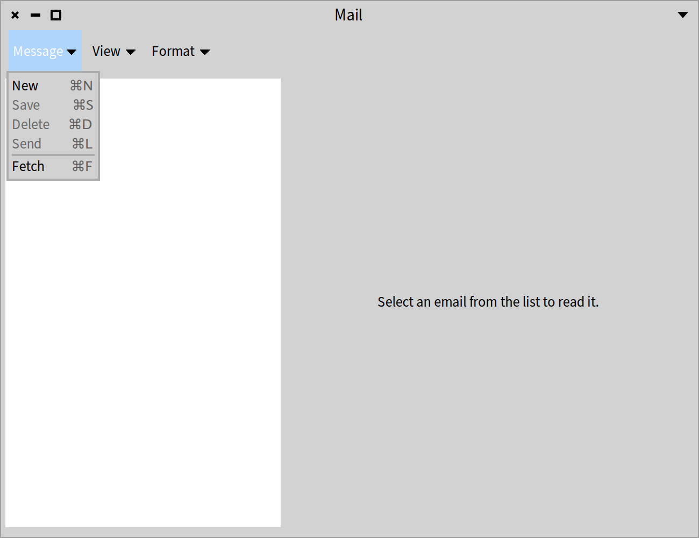
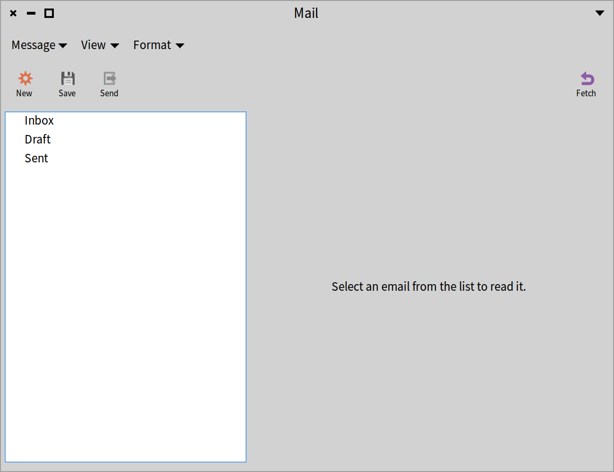
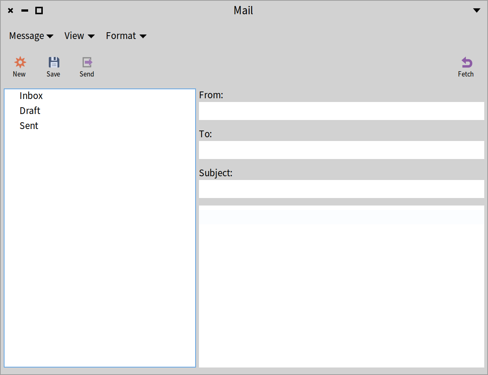
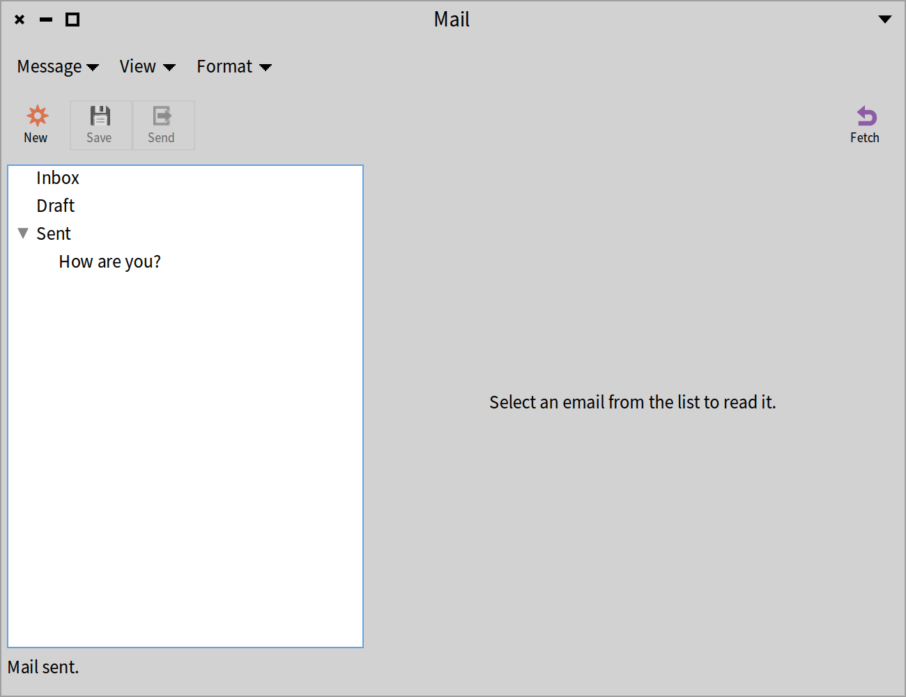
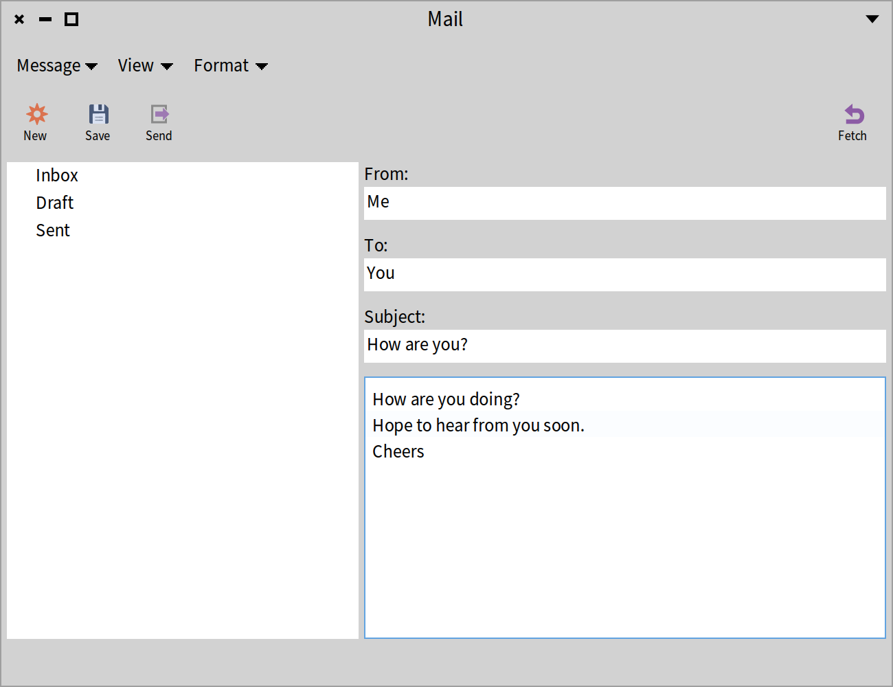
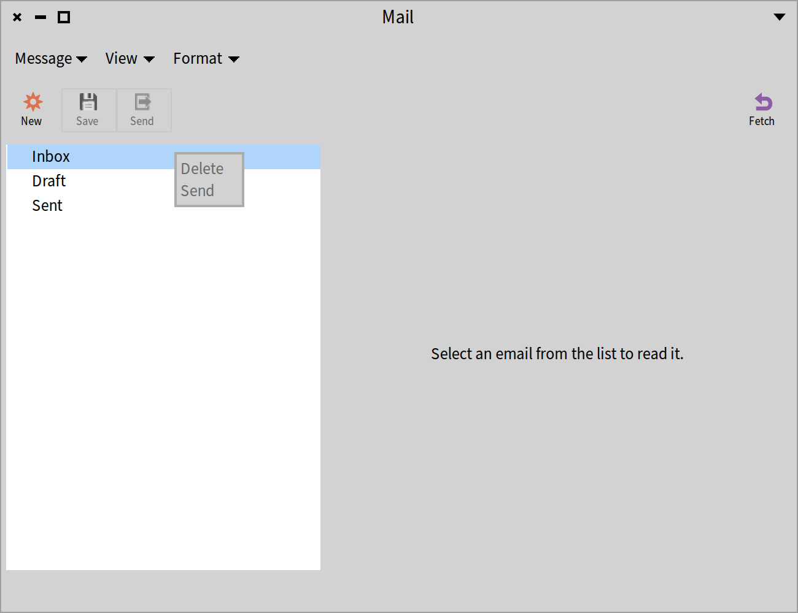
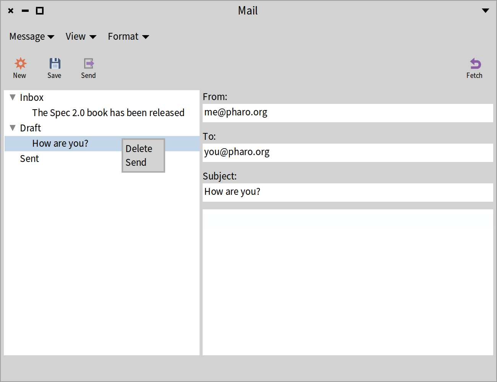

## Menubar, Toolbar, Status Bar, and Context Menus
@cha_menus

Often application windows have a menubar that includes all commands provided by the application. Application windows may also have a toolbar, with buttons for commands that are used frequently. Some applications only have a toolbar. Apart from supporting a menubar and toolbar, Spec supports a status bar at the bottom of a window. Some widgets, such as text fields, tables, and lists, are equipped with context menus. All these aspects are the subject of this chapter.

We will improve the email client application we built in Chapter *@cha_mailapp@*. We will add a menubar, a toolbar, a status bar, and a context menu. Figure *@MailClientWithDecorations@* shows the result that we like to achieve.


### Adding a menubar to a window

With all the models and presenters in place as described in the previous chapter, we can dive into the subject of this chapter -- remember that all the code is available as explained in Chapter *@chaintroductions@*. We start by adding a menubar with commands to manipulate emails.

A menubar is part of a window presenter. Therefore it is configured in the `initializeWindow:` method. A `SpWindowPresenter` instance understands the message `menu:` to set the menubar.

```
MailClientPresenter >> initializeWindow: aWindowPresenter

	aWindowPresenter
		title: 'Mail';
		initialExtent: 650@500;
		menu: menuBar
```

The instance variable `menuBar` is not defined yet, so let's do that first. We add it to the class definition.

```
SpPresenterWithModel << #MailClientPresenter
	slots: { #account . #reader . #editedEmail . #menuBar };
	package: 'CodeOfSpec20Book'
```

Then we have to bind it. We elaborate the `initializePresenters` method to initialize the `menuBar` instance. The method delegates that responsibility to the method `initializeMenuBar`.

```
MailClientPresenter >> initializePresenters

	account := MailAccountPresenter on: self model.
	reader := MailReaderPresenter new.
	self initializeMenuBar
```

```
MailClientPresenter >> initializeMenuBar

	menuBar := self newMenuBar
		addItem: [ :item |
			item
				name: 'Message';
				subMenu: self messageMenu;
				yourself ];
		addItem: [ :item |
			item
				name: 'View';
				subMenu: self viewMenu;
				yourself ];
		addItem: [ :item |
			item
				name: 'Format';
				subMenu: self formatMenu;
				yourself ];
		yourself
```

The expression `self newMenuBar` creates a new `SpMenuBarPresenter` instance. We add three items to it. These items are the main menu items of the menubar. We configure each one with their name and their submenu.

### Implementing message menu commands

In this chapter, we will implement the commands of the "Message" menu. 


The two other menus, "View" and "Format"  are included only to show you multiple menus in the menubar. 
But the method `viewMenu` and  `formatMenu` are basically empty and doing nothing besides creating empty menus. 
We start with the menus that we will not implement. They are short.

```
MailClientPresenter >> viewMenu
	"Empty placeholder Not defined in this chapter"
	^ self newMenu
			addItem: [ :item | item name: 'Show CC field' ];
			addItem: [ :item | item name: 'Show BCC field' ];
			yourself
```

```
MailClientPresenter >> formatMenu
	"Empty placeHolder. Not defined in this chapter"
	^ self newMenu
			addItem: [ :item | item name: 'Plain text' ];
			addItem: [ :item | item name: 'Rich text' ];
			yourself
```

Now we are ready to focus on the "Message" menu commands. We will implement all commands of the "Message" menu. That requires some code:

```
MailClientPresenter >> messageMenu

	^ self newMenu
		addGroup: [ :group |
			group
				addItem: [ :item |
					item
						name: 'New';
						shortcut: $n meta;
						action: [ self newMail ] ];
				addItem: [ :item |
					item
						name: 'Save';
						shortcut: $s meta;
						enabled: [ self hasDraft ];
						action: [ self saveMail ] ];
				addItem: [ :item |
					item
						name: 'Delete';
						shortcut: $d meta;
						enabled: [ self hasSelectedEmail ];
						action: [ self deleteMail ] ];
				addItem: [ :item |
					item
						name: 'Send';
						shortcut: $l meta;
						enabled: [ self hasDraft ];
						action: [ self sendMail ] ] ];
		addGroup: [ :group |
			group
				addItem: [ :item |
					item
						name: 'Fetch';
						shortcut: $f meta;
						action: [ self fetchMail ] ];
				yourself ]
```

While the first two menus included two commands, this menu includes several commands in two groups. With the `addGroup` message, we add the groups and we nest the menu items in the groups by sending the message `addItem:` to the groups. As you can see, the menu items have a name, a keyboard shortcut, and an action block. A few items have a block that defines whether they are enabled. The block argument of the `enabled:` message is evaluated each time the menu item is displayed, so that the menu item can be enabled or disabled dynamically. Note that block arguments of the `enabled:` messages send the messages `hasDraft` and `hasSelectedEmail`. We did not define the corresponding methods yet, so let's do that now. The implementations are straightforward.

```
MailClientPresenter >> hasDraft

	^ editedEmail isNotNil
```

```
MailClientPresenter >> hasSelectedEmail

	^ account hasSelectedEmail
```

Look at the shortcuts in the `messageMenu` method. `$n meta` means that the character "n" can be pressed together with the meta key (Command on macOS, Control on Windows and Linux) to trigger the command.


### Installing shortcuts

Adding shortcuts to menu items does not automatically install them. Keyboard shortcuts have to be installed after the window has been opened. Therefore we have to adapt the `initializeWindow:` method with the `whenOpenedDo:` message, so that the keyboard shortcuts can be installed after opening the window. `SpMenuPresenter`, which is the superclass of `SpMenuBarPresenter`, implements the method `addKeybindingsTo:`, which comes in handy here.

```
MailClientPresenter >> initializeWindow: aWindowPresenter

	aWindowPresenter
		title: 'Mail';
		initialExtent: 650@500;
		menu: menuBar.
		menuBar addKeybindingsTo: aWindowPresenter
```


### Defining actions

We keep the action blocks simple by sending a message. We have to implement them of course, so let's do that. Based on the models that we defined earlier in this chapter, the implementation of the actions is fairly straightforward.

```
MailClientPresenter >> newMail

	editedEmail := Email new.
	editedEmail beDraft.
	reader updateLayoutForEmail: editedEmail.
	self modelChanged
```

```
MailClientPresenter >> saveMail

	account saveAsDraft: editedEmail.
	editedEmail := nil.
	self modelChanged
```

```
MailClientPresenter >> deleteMail

	account deleteMail.
	self modelChanged
```

```
MailClientPresenter >> sendMail

	account sendMail: editedEmail.
	editedEmail := nil.
	self modelChanged
```

```
MailClientPresenter >> fetchMail

	account fetchMail.
	self modelChanged
```

It is time to try it out. To see the menubar in action, let's open a window with:

```
(MailClientPresenter on: MailAccount new) open
```

Figure *@MailClientWithMenuBar@* shows the window. The menubar includes the three menus we defined. The figure shows the open "Message" menu. It has two groups of menu items, separated by a horizontal line. Two menu items are enabled. Three menu items are disabled because they are actions on an email but no email is selected.




### Adding a toolbar to a window

Some actions are so common that it is useful to have them one click away. That is where the toolbar comes in. A toolbar allows putting actions as buttons in the user interface (See Figure *@MailClientWithToolBar@*).

Not surprisingly, like the menubar, the toolbar is part of a window presenter. So we have to revisit the `initializeWindow:` method. A `SpWindowPresenter` instance understands the message `toolbar:` to set the toolbar.

```
MailClientPresenter >> initializeWindow: aWindowPresenter

	aWindowPresenter
		title: 'Mail';
		initialExtent: 650@500;
		menu: menuBar;
		toolbar: toolBar.
		menuBar addKeybindingsTo: aWindowPresenter
```

`toolbar` is an instance variable, so we have to elaborate the class definition:

```
SpPresenterWithModel << #MailClientPresenter
	slots: { #account . #reader . #editedEmail . #menuBar . #toolBar };
	package: 'CodeOfSpec20Book'
```

Similar to what we did for the menubar, we define a method `initializeToolBar` and use it in `initializePresenters`.

```
MailClientPresenter >> initializePresenters

	account := MailAccountPresenter on: self model.
	reader := MailReaderPresenter new.
	self initializeMenuBar.
	self initializeToolBar
```

```
MailClientPresenter >> initializeToolBar

	| newButton fetchButton |
	newButton := self newToolbarButton
		label: 'New';
		icon: (self iconNamed: #smallNew);
		help: 'New email';
		action: [ self newMail ];
		yourself.
	saveButton := self newToolbarButton
		label: 'Save';
		icon: (self iconNamed: #smallSave);
		help: 'Save email';
		action: [ self saveMail ];
		yourself.
	sendButton := self newToolbarButton
		label: 'Send';
		icon: (self iconNamed: #smallExport);
		help: 'Send email';
		action: [ self sendMail ];
		yourself.
	fetchButton := self newToolbarButton
		label: 'Fetch';
		icon: (self iconNamed: #refresh);
		help: 'Fetch emails from server';
		action: [ self fetchMail ];
		yourself.
	toolBar := self newToolbar
		addItem: newButton;
		addItem: saveButton;
		addItem: sendButton;
		addItemRight: fetchButton;
	yourself
```

This method defines four buttons, of which two are held in instance variables. Shortly, it will become clear why. Of course, we have to adapt the class definition again:

```
SpPresenterWithModel << #MailClientPresenter
	slots: { #account . #reader . #editedEmail . #menuBar . #toolBar . #sendButton . #saveButton };
	package: 'CodeOfSpec20Book'
```



The `initializeToolBar` method adds four buttons to the toolbar. A toolbar has two sections, one on the left and one on the right. With the message `addItem:` we add the first three buttons to the left section. With the message `addItemRight:` we add one button to the right section.

Each button has a label, an icon, a help text, and an action. As we did in `initializeMenuBar`, we use simple action blocks that send a message to the mail client presenter. These are the same messages that we used in the action blocks of the menu items in the "Message" menu in the menubar. That means that we are done.


### Supporting enablement
We said we were done but well, not really. The menu items had a block to determine whether they were enabled or disabled. That is not the case for toolbar buttons, because they are visible all the time. Therefore we have to manage enablement of the buttons explicitly. Every time the state of the mail client changes, we have to update the enablement of the toolbar buttons. We introduce a new method `updateToolBarButtons` to do that. Based on messages that were defined before, we can set the enablement state of the `saveButton` and the `sendButton`. That is why we defined both as instance variables. The two other buttons are always enabled, so it is not needed to hold them in instance variables.

```
MailClientPresenter >> updateToolBarButtons

	| hasSelectedDraft |
	hasSelectedDraft := self hasDraft.
	saveButton enabled: hasSelectedDraft.
	sendButton enabled: hasSelectedDraft
```

To finish the toolbar functionality, we have to send `updateToolBarButtons` in the appropriate places. Everywhere the state of the mail client presenter changes, we have to send the message. You may think we have to do that in many places, but we have implemented the presenter class in such a way that there are only two places where it is required.

First, `MailClientPresenter` inherits from `SpPresenterWithModel`, which means that every time the model of an instance changes, it sends `modelChanged`. So we can update the toolbar buttons in that method.

```
MailClientPresenter >> modelChanged

	self updateToolBarButtons
```

Second, we have to set the initial state of the toolbar buttons when the mail client presenter is initialized. The method `updateAfterSelectionChangedTo:`, invoked by the method `connectPresenters`, is a good place to update the toolbar buttons. We add an extra line at the bottom of the method that we defined before.

```
MailClientPresenter >> updateAfterSelectionChangedTo: selectedFolderOrEmail

	super updateAfterSelectionChangedTo: selectedFolderOrEmail.
	self updateToolBarButtons
```

As for the menubar, it required a lot of code to setup the toolbar and wire everything, but we are ready. Let's open the window again.

```
(MailClientPresenter on: MailAccount new) open
```


Figure *@MailClientWithToolBar@* shows the window. It has a menubar and a toolbar. Three toolbar buttons are placed on the left side, and one button is placed at the right side. That corresponds to our configuration of the toolbar. The save button and the send button are greyed out because they are disabled.


Let's create a new email by pressing the toolbar button labeled "New" and see how the enablement state of the toolbar buttons changes. Figure *@MailClientWithToolBarForEmail@* shows that all the buttons are enabled.



### Adding a status bar to a window

After adding a menubar and a toolbar, we will add a status bar (see Figures *@MailClientTest-2@* and *@MailClientTest-3@*). A status bar is useful to show short messages for some time, or until the next message appears. We will elaborate the mail client presenter to show messages to inform the user that actions have been performed.




The status bar appears at the bottom of the window. As with the menubar and the toolbar, we add it in the method `initializeWindow:`.

```
MailClientPresenter >> initializeWindow: aWindowPresenter

	aWindowPresenter
		title: 'Mail';
		initialExtent: 650@500;
		menu: menuBar;
		toolbar: toolBar;
		statusBar: statusBar.
		menuBar addKeybindingsTo: aWindowPresenter
```

`statusBar` is a new instance variable, which we add to the class definition of the presenter.

```
SpPresenterWithModel << #MailClientPresenter
	slots: { #account . #reader . #editedEmail . #menuBar . #toolBar . #statusBar };
	package: 'CodeOfSpec20Book'
```

As already done twice, we adapt the `initializePresenters` method. The message `newStatusBar` creates a new `SpStatusBarPresenter` instance.

```
MailClientPresenter >> initializePresenters

	account := MailAccountPresenter on: self model.
	reader := MailReaderPresenter new.
	self initializeMenuBar.
	self initializeToolBar.
	statusBar := self newStatusBar
```

The status bar is no more than a container for a text message. We will adapt some action methods to put messages in the status bar. A `SpStatusBarPresenter` instance responds to `pushMessage:` and `popMessage:`. Let's start with the method `fetchMail`. We push a message "Mail fetched." to indicate that the fetch action was successful.

```
MailClientPresenter >> fetchMail

	account fetchMail.
	self modelChanged.
	statusBar pushMessage: 'Mail fetched.'
```

Then we adapt the other action methods as well.

```
MailClientPresenter >> saveMail

	account saveAsDraft: editedEmail.
	editedEmail := nil.
	self modelChanged.
	statusBar pushMessage: 'Mail saved to drafts.'
```

```
MailClientPresenter >> sendMail

	account sendMail: editedEmail.
	editedEmail := nil.
	self modelChanged.
	statusBar pushMessage: 'Mail sent.'
```

```
MailClientPresenter >> deleteMail

	account deleteMail.
	self modelChanged.
	statusBar pushMessage: 'Mail deleted.'
```

To finish the status bar functionality, we start with a clean status bar. Therefore we adapt the method `updateAfterSelectionChangedTo:` again, in which we already bring the toolbar buttons in their initial enablement state. We send the message `popMessage` to ensure that the status bar is empty.

```
MailClientPresenter >> updateAfterSelectionChangedTo: selectedFolderOrEmail

	super updateAfterSelectionChangedTo: selectedFolderOrEmail.
	self updateToolBarButtons.
	statusBar popMessage
```

Let's test the mail client presenter by opening it again.

```
(MailClientPresenter on: MailAccount new) open
```

We will test a full scenario.

* After opening the window, press the "New" button and fill in the fields of the new email. Figure *@MailClientTest-1@* shows the initial state before we start manipulating the email.
* When the fields are filled in, we save the email by pressing the save button. See Figure *@MailClientTest-2@*. The status bar shows "Mail saved to drafts." and we see the subject of the email nested under the "Draft" folder in the list on the left.
* After selecting the email in the list and pressing the "Send" button, we see the situation in Figure *@MailClientTest-3@*. The email has moved from the "Draft" folder to the "Sent" folder, and the status bar shows "Mail sent.".
* After pressing the "Fetch" button, the fetched email appears under the "Inbox" folder in the list. The status bar shows "Mail fetched.". See Figure *@MailClientTest-4@*.
* After selecting the email in the "Inbox" and choosing "Delete" from the "Message" menu, the email is removed from the list, and the status bar shows "Mail deleted.". See Figure *@MailClientTest-5@*.




All actions that change the status bar have been tested.

### Adding a context menu to a presenter

The final step to complete the mail client presenter is the addition of a context menu. We will add a context menu to the tree with the folders and emails. We will not add a big context menu. For demonstration purposes, we will restrict the menu to two menu items, one to delete an email and one to send an email.

The tree includes folders and emails, so the desired menu items should be disabled when a folder is selected. They should also be disabled when no selection has been made. On top of that condition, the send command can only be applied to emails that are in the "Draft" folder because received and sent mails cannot be sent.

Typically, a presenter adds a context menu to a subpresenter. Given that the tree of folders and emails is a subpresenter of the `MailAccountPresenter`, we would expect the `MailAccountPresenter` to install a context menu on the tree presenter. However, the `MailAccountPresenter` cannot decide what needs to be done for deleting or sending an email. What needs to be done is the responsibility of the `MailClientPresenter`, which defines the methods `deleteMail` and `sendMail`. Both methods do what they have to do to perform the action, and then send the `modelChanged` message and update the status bar.

Therefore `MailClientPresenter` defines the menu.

```
MailClientPresenter >> accountMenu

	^ self newMenu
			addItem: [ :item |
				item
					name: 'Delete';
					enabled: [ self hasSelectedEmail ];
					action: [ self deleteMail ] ];
			addItem: [ :item |
				item
					name: 'Send';
					enabled: [ self hasSelectedEmail
											and: [ account selectedItem isDraft] ];
					action: [ self sendMail ] ];
			yourself
```

The action blocks are simple, like the action blocks of the menu items in the menubar and the buttons in the toolbar. They send the action messages `deleteMail` and `sendMail` we have defined before.


### Enabling blocks

More interestingly are the `enabled:` blocks, which define the enablement of the menu items. Deleting an email is possible only when an email is selected. That is expressed by the `enabled:` block of the "Delete" menu item. As described in the introduction of this section, sending an email is possible only if the selected email is a draft email. That is exactly what the `enabled:` block for the "Send" menu item expresses.

Note the name of the method. We use the name `accountMennu` because the context menu will be installed on the `MailAccountPresenter`. However, the context menu has to be installed on the tree presenter with the folders and the emails. Therefore `MailAccountPresenter` delegates to the tree presenter. Let's realise that in code. First, from within `initializePresenters` of `MailClientPresenter`, we send the `contextMenu:` message to install the context menu on the `MailAccountPresenter`.

```
MailClientPresenter >> initializePresenters

	account := MailAccountPresenter on: self model.
	account contextMenu: [ self accountMenu ].
	reader := MailReaderPresenter new.
	self initializeMenuBar.
	self initializeToolBar.
	statusBar := self newStatusBar
```

Then we implement the `contextMenu:` on `MailAccountPresenter`. It delegates to the tree presenter,

```
MailAccountPresenter >> contextMenu: aBlock

	foldersAndEmails contextMenu: aBlock
```

That concludes the implementation. It is time to open the window again and try the new context menu.

```
(MailClientPresenter on: MailAccount new) open
```

When clicking the right-button mouse button, the context menu appears. Figure *@ContextMenuDisabled@* shows that the two menu items are disabled when a folder is selected



After fetching email and selecting the received email, the menu includes an enabled "Delete" menu item and a disabled "Send" menu item, as shown in Figure *@ContextMenuSendDisabled@*.


As a final test, we create a new email, save it, and select it. It is a draft email, so it can be sent. That is what we see in the context menu in Figure *@ContextMenuEnabled@*. Both menu items are enabled.



### Conclusion

We have described how to add a menubar and a toolbar to a window. It required quite some code to define the menu items and the toolbar buttons. We have also described how messages can be shown in the status bar at the bottom of a window. At the end, we also described how to add a context menu to a tree presenter.

An important aspect of menu items and toolbar buttons is their enablement based on the state of the presenter in a window. We have shown how to apply enablement, and we illustrated the behavior in several figures.