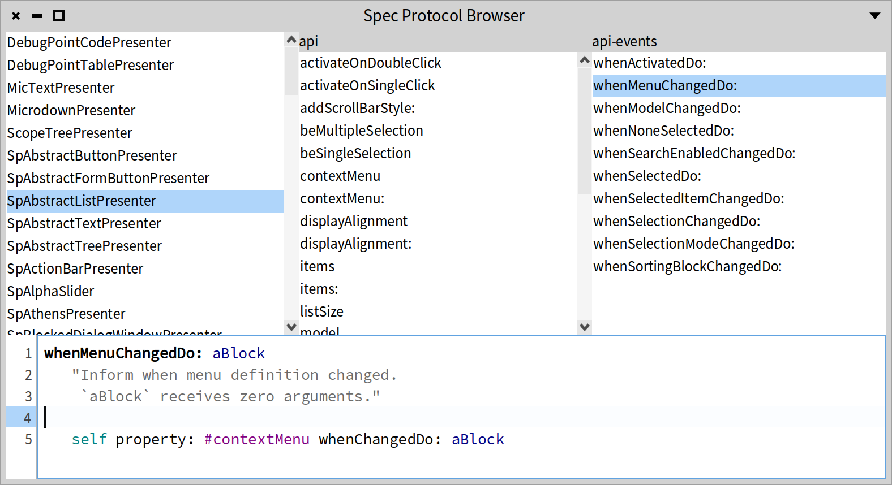
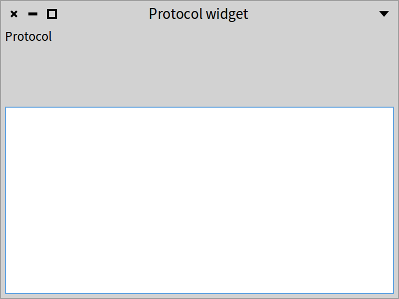
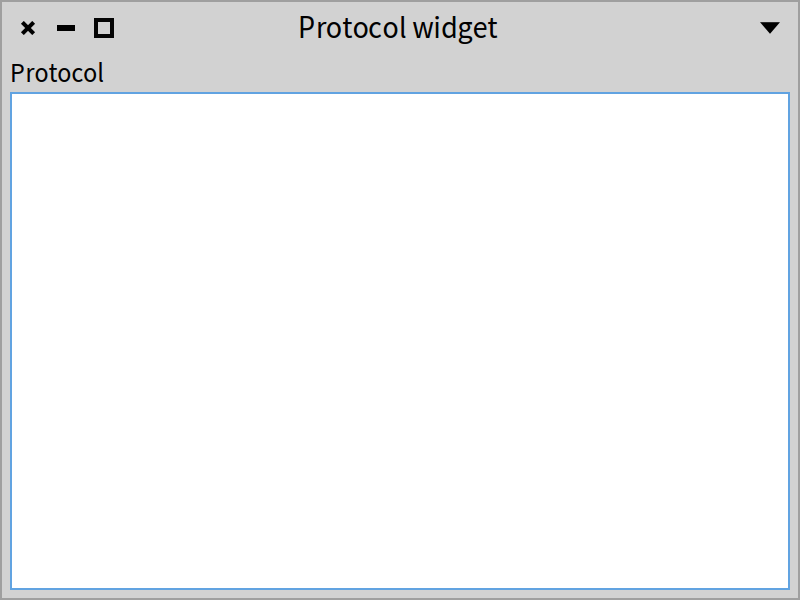
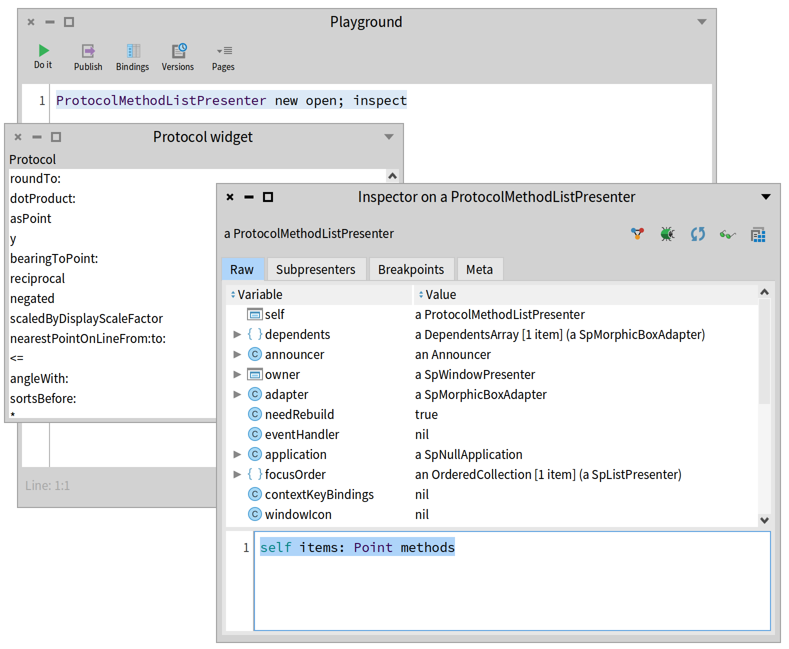
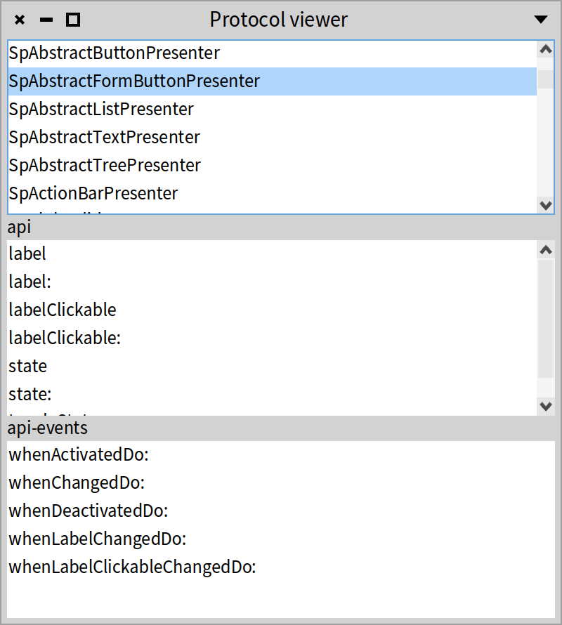
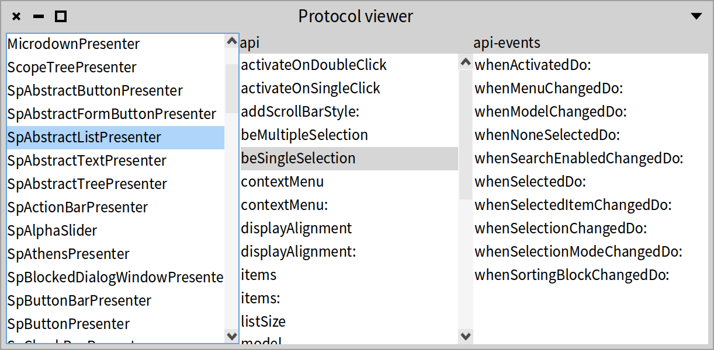

## Reuse and composition at work
@cha_reuse

A key design goal of Spec is to enable the seamless reuse of user interfaces. The reason for this is that it results in a significant productivity boost when creating user interfaces.

This focus on reuse was actually already visible in the previous chapters, where we have seen that basic widgets can be used as if they were complete user interfaces. In this section we focus on the reuse and composition of presenters, showing that it basically comes for free. The only requirement when building a UI is to consider how the user interface should be parameterized when it is being reused.

Said differently, in this chapter, you will learn how you can build a new UI by reusing already defined elements.

### First requirements



To show how Spec enables the composition and reuse of user interfaces, in this chapter we build the user interface shown in Figure *@figprotocolbrowser@* as a composition of four parts:
1. The **WidgetClassListPresenter**: This widget contains a `SpListPresenter` specifically for displaying the subclasses of `SpAbstractWidgetPresenter`.
1. The **ProtocolMethodListPresenter**: This widget is composed of a `SpListPresenter` and a `SpLabelPresenter` for displaying methods of a protocol.
1. The **ProtocolViewerPresenter**:  This widget is a composition of one `WidgetClassListPresenter` and two `ProtocolMethodListPresenter`. It allows browsing the methods of all subclasses of `SpAbstractWidgetPresenter`.
1. The **ProtocolCodeBrowserPresenter**: This widget reuses a `ProtocolViewerPresenter`, changes its layout, and adds a `SpTextPresenter` to see the source code of the methods.


### Creating a basic UI to be reused as a widget
@sec_WidgetClassList

The first UI we build displays a list of all subclasses of the class `SpAbstractWidgetPresenter`. This UI will later be reused as a widget for a more complete UI. The code is as follows.

First, we create a subclass of `SpPresenter` with one instance variable `list` which will hold an instance of `SpListPresenter`.

```
SpPresenter << #WidgetClassListPresenter
	slots: { #list };
	package: 'CodeOfSpec20Book'
```

In the method `initializePresenters`, we create the list and populate it with the required classes, in alphabetical order.

```
WidgetClassListPresenter >> initializePresenters

	list := self newList.
	list items: (SpAbstractWidgetPresenter allSubclasses sorted: [:a :b | a name < b name ]).
	self focusOrder add: list
```

We also add a title for the window.

```
WidgetClassListPresenter >> initializeWindow: aWindowPresenter

	aWindowPresenter title: 'Widgets'
```

The layout contains only the list.

```
WidgetClassListPresenter >> defaultLayout

	^ SpBoxLayout newLeftToRight
			add: #list;
			yourself
```

When doing `WidgetClassListPresenter new open`, you should see the UI shown in Figure *@WidgetClassList@*.


### Supporting reuse


Since this UI will later be used together with other widgets to provide a more complete user interface, some actions will need to occur when a list item is clicked. However, we cannot know beforehand what all these possible actions will be everywhere that it will be reused. Therefore the best solution is to place this responsibility on the reuser of the widget. Every time this UI is reused as a widget, it will be configured by the reuser. To allow this, we add a configuration method named `whenSelectionChangedDo:` as follows:

```
WidgetClassListPresenter >> whenSelectionChangedDo: aBlock

	list whenSelectionChangedDo: aBlock
```


Now, whoever reuses this widget can parameterize it with a block that will be executed whenever the selection changes.

### Combining two basic presenters into a reusable UI
@sec_protocollist

The UI we build next will show a list of all methods of a given protocol, and it combines two widgets: a list and a label. Considering reuse, there is no difference from the previous UI. This is because the reuse of a UI as a widget is _not impacted at all_ by the number of widgets it contains (nor by their position). Large and complex UIs are reused in the same way as simple widgets.

```
SpPresenter << #ProtocolMethodListPresenter
	slots: { #label . #methods };
	package: 'CodeOfSpec20Book'
```


The `initializePresenters` method for this UI is straightforward. We specify the default label text as 'Protocol', which will be changed when the widget is reused.

```
ProtocolMethodListPresenter >> initializePresenters

	methods := self newList.
	methods display: [ :m | m selector ].
	label := self newLabel.
	label label: 'Protocol'.
	self focusOrder add: methods
```


To make sure that we have a nice title when the widget is opened in a window, we
define the method `initializeWindow:`.

```
ProtocolMethodListPresenter >> initializeWindow: aWindowPresenter

	aWindowPresenter title: 'Protocol widget'
```

The layout code builds a column with the label above the method list.

```
ProtocolMethodListPresenter >> defaultLayout

	^ SpBoxLayout newTopToBottom
			add: #label;
			add: #methods;
			yourself
```

This UI can be seen by executing `ProtocolMethodList new open`. As shown in Figure *@figprotocollist@* the list is empty and the result is not really nice. This is normal because we did not set any items. We should also place the elements better.



```

ProtocolMethodListPresenter >> defaultLayout

	^ SpBoxLayout newTopToBottom
			add: #label expand: false;
			add: #methods;
			yourself
```


Now you should get a better UI as shown in Figure *@figprotocollist2@*.




Our protocol method list needs to be configured when it is used, by filling the list of methods and specifying what the name of the protocol is. To allow this, we add some configuration methods:

```
ProtocolMethodListPresenter >> items: aCollection

	methods items: aCollection
```

```
ProtocolMethodListPresenter >> label: aText

	label label: aText
```

```
ProtocolMethodListPresenter >> resetSelection

	methods selection unselectAll
```


```
ProtocolMethodListPresenter >> whenSelectionChangedDo: aBlock

	methods whenSelectionChangedDo: aBlock
```

### Live inspection of the widgets

Now we can check manually if the widget is working by doing:

```
ProtocolMethodListPresenter new open; inspect
```


Then in the inspector, we can use the newly created presenter to pass a collection of methods. See the result in Figure *@figinspectingLive@*.

```
self items: Point methods
```




Now we can play and for example, decide to sort the items as follows:

```
self items: (Point methods sort: #selector ascending)
```


### Writing tests

When we start to feel the need to check manually what we have done, that is a sign that we should write a test instead. It is easy to write simple tests for widgets when we do not use popups. So let's take advantage of that.

We add an accessor to access the method list.

```
ProtocolMethodListPresenter >> methods

	^ methods
```

```
TestCase << #ProtocolMethodListPresenterTest
	slots: {};
	package: 'CodeOfSpec20Book'
```

```
ProtocolMethodListPresenterTest >> testItems

	| proto methods |
	methods := Point methods sort: #selector ascending.
	proto := ProtocolMethodListPresenter new.
	proto items: methods.
	self assert: proto methods items first class equals: CompiledMethod.
	self assert: proto methods items first selector equals: methods first selector
```


We hope that we convinced you that writing simple UI tests is easy with Spec. Do not miss this opportunity to control the complexity of your software.


### Managing three widgets and their interactions
@sec_protocolviewer

The third user interface we build is a composition of the two previous user interfaces. We will see that there is no difference between configuring custom UIs and configuring system widgets: both kinds of widgets are configured by calling methods of the 'api' protocol.

This UI is composed of a `WidgetClassListPresenter` and two `ProtocolMethodListPresenter`s. It specifies that when a model class is selected in the `WidgetClassListPresenter`, the methods in the protocols 'api' and 'api-events' will be shown in the two `ProtocolMethodListPresenter` widgets.

```
SpPresenter << #ProtocolViewerPresenter
	slots: { #models . #api . #events };
	package: 'CodeOfSpec20Book'
```


The `initializePresenters` method shows the use of `instantiate:` to instantiate widgets, and some of the different parameterization methods of the `ProtocolMethodListPresenter` class.

```
ProtocolViewerPresenter >> initializePresenters

	models := self instantiate: WidgetClassListPresenter.
	api := self instantiate: ProtocolMethodListPresenter.
	events := self instantiate: ProtocolMethodListPresenter.

	api label: 'api'.
	events label: 'api-events'.

	self focusOrder
		add: models;
		add: api;
		add: events
```


```
ProtocolViewerPresenter >> initializeWindow: aWindowPresenter

	aWindowPresenter title: 'Protocol viewer'
```


To describe the interactions between the different widgets we define the `connectPresenters` method. It specifies that when a class is selected, the selections in the method lists are reset and both method lists are populated. Additionally, when a method is selected in one method list, the selection in the other list is reset.

```
ProtocolViewerPresenter >> connectPresenters

	models whenSelectionChangedDo: [ :selection |
		| class |
		api resetSelection.
		events resetSelection.
		class := selection selectedItem.
		class
			ifNil: [
				api items: #().
				events items: #() ]
			ifNotNil: [
				api items: (self methodsIn: class for: 'api').
				events items: (self methodsIn: class for: 'api - events') ] ].

	api whenSelectionChangedDo: [ :selection |
 		selection selectedItem ifNotNil: [ events resetSelection ] ].
	events whenSelectionChangedDo: [ :selection |
		selection selectedItem ifNotNil: [ api resetSelection ] ]
```


```
ProtocolViewerPresenter >> methodsIn: class for: protocol

	^ (class methodsInProtocol: protocol)
			sorted: [ :a :b | a selector < b selector ]
```

Lastly, the layout puts the subpresenters in one column, with all subpresenters taking the same amount of space.

```
ProtocolViewerPresenter >> defaultLayout

	^ SpBoxLayout newTopToBottom
		add: #models;
		add: #api;
		add: #events;
		yourself
```



As previously, the result can be seen by executing the following snippet of code. The result is shown in Figure *@figProtocolViewerVertical@*.

```
ProtocolViewerPresenter new open
```

This user interface is functional. Clicking on a class will show the methods of the 'api' and the 'api-events' protocols of that class.


### Having different layouts


Note that you can change the layout as follows to get all the widgets in a row as shown in Figure *@figProtocolViewerHorizontal@*. We will show later that a presenter can have multiple layouts and that the programmer decides which one to use.


We can do better. Let us define two methods as follows:

```
ProtocolViewerPresenter >> horizontalLayout

	^ SpBoxLayout newLeftToRight
		add: #models;
		add: #api;
		add: #events;
		yourself
```

```
ProtocolViewerPresenter >> verticalLayout

	^ SpBoxLayout newTopToBottom
		add: #models;
		add: #api;
		add: #events;
		yourself
```

```
ProtocolViewerPresenter >> defaultLayout

	^ self verticalLayout
```

Now we can decide to open the viewer with different layouts using the message `openWithLayout:` as follows. See Figure *@figProtocolViewerHorizontal@* for the result.

```
ProtocolViewerPresenter class >> exampleHorizontal

    | inst |
    instance := self new.
    instance openWithLayout: instance horizontalLayout
```





### Enhancing our API


Similar to the second user interface, when this UI is reused it will probably need to be configured. The relevant configuration here is what to do when a selection change happens in any of the three lists. Hence we add the following three methods to the 'api' protocol.

```
ProtocolViewerPresenter >> whenSelectionInAPIChanged: aBlock

	api whenSelectionChangedDo: aBlock
```

```
ProtocolViewerPresenter >> whenSelectionInClassChanged: aBlock

	models whenSelectionChangedDo: aBlock
```

```
ProtocolViewerPresenter >> whenSelectionInEventChanged: aBlock

	events whenSelectionChangedDo: aBlock
```


**Note.**
These methods add semantic information to the configuration API. They state that they configure what to do when a class, 'api', or 'api-events' list item has been changed. This arguably communicates the customization API more clearly than just having the subpresenters accessible.


### Changing the layout of a reused widget

@sec_protocolbrowser

Sometimes, when you want to reuse an existing UI as a widget, the layout of that UI is not appropriate for your needs. Nonetheless Spec allows you to reuse such a UI by overriding the layout of its widgets, and we show this here.

Our last user interface reuses the `ProtocolViewerPresenter` with a different layout and adds a text zone to edit the source code of the selected method.

```
SpPresenter << #ProtocolCodeBrowserPresenter
	slots: { #text . #viewer };
	package: 'CodeOfSpec20Book'
```

```
ProtocolCodeBrowserPresenter >> initializePresenters

	text := self instantiate: SpCodePresenter.
	viewer := self instantiate: ProtocolViewerPresenter.
	text syntaxHighlight: true.
	self focusOrder
		add: viewer;
		add: text
```

```
ProtocolCodeBrowserPresenter >> defaultLayout

	^ SpBoxLayout newTopToBottom
			add: (SpBoxLayout newLeftToRight add: #viewer; yourself);
			add: #text;
			yourself
```

```
ProtocolCodeBrowserPresenter >> initializeWindow: aWindowPresenter

	aWindowPresenter title: 'Spec Protocol Browser'
```

The `connectPresenters` method is used to make the text zone react to a selection in the lists. When a method is selected, the text zone updates its contents to show the source code of the selected method.

```
ProtocolCodeBrowserPresenter >> connectPresenters

	viewer whenSelectionInClassChanged: [ :selection |
		text behavior: selection selectedItem ].
	viewer whenSelectionInAPIChanged: [ :selection |
		selection selectedItem
			ifNotNil: [ :item | text beForMethod: item; text: item sourceCode ] ].
	viewer whenSelectionInEventChanged: [ :selection |
		selection selectedItem
			ifNotNil: [ :item | text beForMethod: item; text: item sourceCode ] ]
```

With the current implementation of `initializePresenters`, opening a window with `ProtocolCodeBrowserPresenter new open` results in a vertical layout for the `ProtocolViewerPresenter` instance held in the `viewer` instance variable because its default layout is the vertical layout. Our objective was to use a different layout. That can be achieved by sending `layout:` to the `viewer`. So let's adapt `initializePresenters` that way.

```
initializePresenters

	text := self instantiate: SpCodePresenter.
	viewer := self instantiate: ProtocolViewerPresenter.
	viewer layout: viewer horizontalLayout.
	text syntaxHighlight: true.
	self focusOrder
		add: viewer;
		add: text
```

Now a window opens as shown in Figure *@figprotocolbrowser@*.


### Changing layouts

There are different ways to configure the layout of a presenter. Let's demonstrate that with `ProtocolViewerPresenter`. The first option is using `openWithLayout:` to open a window.

```
presenter := ProtocolViewerPresenter new.
presenter openWithLayout: (SpBoxLayout newLeftToRight
	add: #models;
	add: #api;
	add: #events;
	yourself)
```

Or you can send `layout` to the presenter and open the window afterwards.

```
presenter := ProtocolViewerPresenter new.
presenter layout: (SpBoxLayout newLeftToRight
	add: #models;
	add: #api;
	add: #events;
	yourself).
presenter open
```

An alternative is to use a layout provided by the presenter, like we did in the previous section.

```
presenter := ProtocolViewerPresenter new.
presenter layout: presenter horizontalLayout.
presenter open
```


### Considerations about a public configuration API
@sec_public_API

In this chapter, we have seen several definitions of methods in the public configuration API of the presenter being built. The implementation of our configuration methods is simply delegated to internal widgets, but a configuration can of course be more complex than that, depending on the internal logic of the UI.

For methods that simply delegate to the internal widgets, the question is whether it makes sense to define these as methods in the 'api' protocols at all. Fundamentally this is a design decision to be made by the programmer. Not having such methods makes the implementation of the presenter more lightweight but comes at the cost of less clear intent and of breaking encapsulation.

For the former cost, we have seen an example in the protocol method list of Section *@sec_protocollist@*. The presence of the three methods defined there communicates to the user that we care about what to do when a class, 'api' or 'api-events' list item has been changed. Fundamentally the same also holds for the other examples in this chapter: each method in an 'api' protocol communicates an intent to the reuser: this is how we expect that this presenter will be configured. Without such declared methods, it is less clear to the reuser what can be done to effectively reuse a presenter.

For the latter cost, expecting reusers of the widget to directly send messages to internal objects (in instance variables) means breaking encapsulation. As a consequence, we are no longer free to change the internals of the UI, e.g., by renaming the instance variables to a better name or changing the kind of widget used. Such changes may break reusers of the presenter and hence severely limit how we can evolve this presenter in the future. It is safer to define a public API and ensure in future versions of the presenter that the functionality of this API remains the same.

So in the end it is important to consider future reusers of your UI and the future evolution of your UI. You need to make a tradeoff between writing extra methods and possibly making reuse of the UI harder as well as possibly making future evolution of the UI harder.

### New versus old patterns

In Spec 1.0, list presenters exposed a different API, namely `whenSelectedItemChanged:`, as in the following example.

```
initializePresenters

	models := self instantiate: WidgetClassListPresenter.
	api := self instantiate: ProtocolMethodListPresenter.
	events := self instantiate: ProtocolMethodListPresenter.

	api label: 'api'.
	events label: 'api-events'


connectPresenters

	api whenSelectedItemChanged: [ :method |
		method ifNotNil: [ events resetSelection ] ].
	events whenSelectedItemChanged: [ :method |
		method ifNotNil: [ api resetSelection ] ]
```

In Spec 2.0, list presenters and friends expose a different object that represents the selection of the list. The design rationale is that a selection is a complex object (single selection, multiple selection). So we have:

```
connectPresenters
	api whenSelectionChangedDo: [ :selection |
		selection selectedItem ifNotNil: [ events resetSelection ] ].
	events whenSelectionChangedDo: [ :selection |
		selection selectedItem ifNotNil: [ api resetSelection ] ]
```

The question for your presenters is what is the API that you should expose to your users. If you like the Spec 1.0 way, that is still possible as shown below.

```
whenSelectedItemChangedDo: aBlock
	methods whenSelectionChangedDo: [ :selection |
		selection selectedItem ifNotNil: [ :item | aBlock value: item ] ]
```

But we advise using the Spec 2.0 way because it will give your presenters consistency with the core presenters of Spec and it will be easier to make them collaborate.


### Conclusion

In this chapter, we have discussed a key point of Spec: the ability to seamlessly reuse existing UIs as widgets. This ability comes with no significant cost to the creator of a UI. The only thing that needs to be taken into account is how a UI can (or should) be customized.

The reuse of complex widgets at no significant cost was a key design goal of Spec because it is an important productivity boost for the writing process of UIs. The boost firstly comes from being able to reuse existing nontrivial widgets, and secondly because it allows you to structure your UI in coherent and more easily manageable subparts with clear interfaces. We therefore encourage you to think of your UI as a composition of such subparts and construct it modularly, to yield greater productivity.
